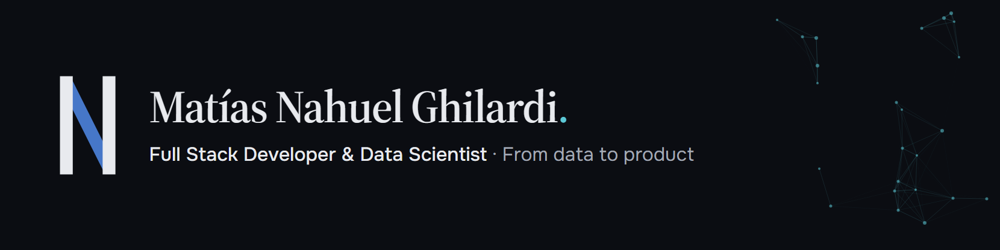

I take products **from data to production**: I design the model, turn it into software and ship it. Based in Tupungato, Mendoza, Argentina, working remotely.

**Now:** technical lead at [Dialogy LLC](https://www.dialogy.info/) (USA), a mobile wellbeing app with an AI assistant.

[Portfolio](https://www.nahuelghilardi.com.ar/en/) · [LinkedIn](https://www.linkedin.com/in/nahuel-ghilardi/) · [Email](mailto:matiasghilardisalinas@gmail.com)

---

### Experience

| When | Where | What |
|---|---|---|
| 2026 — now | **Dialogy LLC** · USA | Freelance technical lead: backend, in-app payments and app store publishing. |
| 2025 — 2026 | **AstroFit** | Co-founded, built and **sold** a gym management SaaS. Supporting the technical handover until December. |
| 2026 | **Hackathon EduTech Mendoza** | Technical staff. Built the event platform: +300 sign-ups, 150 participants, +40 mentors and judges. |

### Case studies

Told from problem to result on my portfolio: [AstroFit](https://www.nahuelghilardi.com.ar/en/cases/astrofit/) · [Hackathon EduTech Mendoza](https://www.nahuelghilardi.com.ar/en/cases/hackathon-edutech/) · [Nimbus AI](https://www.nahuelghilardi.com.ar/en/cases/nimbus-ai/)

### Projects

| Project | What it does | Links |
|---|---|---|
| **Nimbus AI** | Hail early-warning system for Mendoza: 24 years of hand-labelled weather data plus satellite imagery, a dense network and a CNN. | [Code](https://github.com/Nahuelito22/Nimbus-AI) · [Case](https://www.nahuelghilardi.com.ar/en/cases/nimbus-ai/) |
| **Roque Chess** ♞ | A chess bot that plays like a person: an LSTM trained only on real games. | [Play](https://roquechess.vercel.app/) · [Code](https://github.com/Nahuelito22/Bot_Ajedrez) |
| **Siglo 21 · Correlativas** | Interactive map of the 54 courses of my Data Science degree and their prerequisites, built for a community of 150+ classmates. | [Open](https://siglo21-correlativas.vercel.app) · [Code](https://github.com/Nahuelito22/siglo21-correlativas) |
| **Zaha** · *in progress* | Clinical decision support: nurses log vital signs and a model flags early warnings of deterioration. | [Code](https://github.com/Nahuelito22/Zaha) |
| **GameMatch** | Compares a group of friends' Steam libraries and shows what they can all play together. | [Open](https://gamematch-beta.vercel.app) · [Code](https://github.com/Nahuelito22/gamematch) |

### Stack

**Data & AI** — Python · Pandas · Scikit-learn · TensorFlow / Keras · LangChain · Power BI 
**Backend** — Django · FastAPI · PostgreSQL · Supabase 
**Frontend & mobile** — TypeScript · React · React Native (Expo) · Astro · Tailwind CSS 
**Infra & quality** — AWS · Docker · Vercel · Playwright

### Education

- B.Sc. in Data Science · Universidad Siglo 21 · *in progress*
- Higher Technical Degree in Software Development · CESIT 9-023 · *in progress*
- Data Science program · Coderhouse · 2023 — 2025

---

<picture>
  <source media="(prefers-color-scheme: dark)" srcset="https://raw.githubusercontent.com/Nahuelito22/Nahuelito22/output/github-snake-dark.svg">
  <source media="(prefers-color-scheme: light)" srcset="https://raw.githubusercontent.com/Nahuelito22/Nahuelito22/output/github-snake.svg">
  
</picture>

<b>En español</b>

 

Llevo productos **del dato a producción**: diseño el modelo, lo convierto en software y lo pongo en marcha. Soy de Tupungato, Mendoza, y trabajo de forma remota.

**Hoy:** responsable técnico en [Dialogy LLC](https://www.dialogy.info/) (EE.UU.), una app móvil de bienestar emocional con asistente de IA.

- **AstroFit:** cofundé, desarrollé y **vendí** un SaaS de gestión de gimnasios.
- **Hackathon EduTech Mendoza:** staff técnico; desarrollé la plataforma del evento (+300 inscriptos).
- **Nimbus AI:** sistema de alerta temprana de granizo para Mendoza.

Estudio la Licenciatura en Ciencia de Datos (Siglo 21) y la Tecnicatura en Desarrollo de Software (CESIT 9-023).

Más en mi portfolio: [nahuelghilardi.com.ar](https://www.nahuelghilardi.com.ar)

